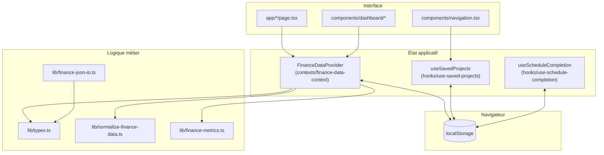

# Finance Pilot

Application web de **pilotage de budget personnel** : revenus, charges fixes, budgets annexes, immobilier locatif, investissements et indicateurs dérivés. Les données restent sur l’appareil du navigateur (stockage local).

## Sommaire

- [Prérequis](#prérequis)
- [Démarrage rapide](#démarrage-rapide)
- [Scripts npm](#scripts-npm)
- [Fonctionnalités principales](#fonctionnalités-principales)
- [Architecture](#architecture)
- [Données et persistance](#données-et-persistance)
- [Internationalisation](#internationalisation)NEXT_PUBLIC_MATOMO_SITE_ID
- [Qualité et évolution](#qualité-et-évolution)

## Prérequis

- [Node.js](https://nodejs.org/) (LTS recommandé)
- [pnpm](https://pnpm.io/) (gestionnaire de paquets utilisé par le projet)

## Démarrage rapide

```bash
pnpm install
pnpm dev
```

Ouvrir [http://localhost:3000](http://localhost:3000).

Build de production :

```bash
pnpm build
pnpm start
```

## Scripts npm


| Script       | Rôle                             |
| ------------ | -------------------------------- |
| `pnpm dev`   | Serveur de développement Next.js |
| `pnpm build` | Compilation optimisée            |
| `pnpm start` | Serveur après `build`            |
| `pnpm lint`  | ESLint sur le dépôt              |


## Fonctionnalités principales

- Saisie et suivi des **revenus**, **charges fixes**, **budgets annexes**, **biens locatifs** et **investissements**.
- **Planification** (catégorie, mode manuel / automatique, jour du mois) pour le pilotage mensuel.
- **Graphiques** (camembert, tendances) et pages de **comparaison** / **estimations**.
- **Projets enregistrés** : plusieurs jeux de données nommés, projet actif, persistance locale.
- **Export / import JSON** des données (barre d’outils sur la page données).
- **Thème** clair / sombre / système et **langue** d’interface (fichiers `locales/`).

## Architecture

### Pile technique

- **Next.js** (App Router), **React**, **TypeScript**
- **Tailwind CSS** v4 pour le style
- **Radix UI** + composants type shadcn dans `components/ui/`
- **react-i18next** pour les textes
- **Recharts** pour les graphiques
- **Zod** (et éventuellement **react-hook-form**) pour la validation côté formulaires / I/O JSON

### Organisation des dossiers

```
app/                    # Routes, layout, styles globaux (App Router)
components/             # Composants réutilisables (navigation, dashboard, etc.)
components/ui/          # Primitives UI (boutons, cartes, dialogues…)
contexts/               # Contexte React principal des données financières
hooks/                  # Hooks (données financières, projets, planification…)
lib/                    # Types, normalisation, calculs métier, i18n, utilitaires
locales/                # Fichiers de traduction (ex. fr, en)
public/                 # Assets statiques servis à la racine
```

### Flux de données (vue d’ensemble)

L’application est majoritairement **côté client** : le provider des données financières charge et enregistre dans `localStorage`, expose des actions CRUD et des agrégats (totaux, disponible à investir, etc.). Les pages consomment ce contexte via le hook `useFinanceData`.




### Principes de conception

1. **Types centralisés** (`lib/types.ts`) : modèle unique des entités financières.
2. **Normalisation à l’entrée** : lecture disque / import JSON passe par `normalizeFinanceData` pour tolérer d’anciennes formes et garantir un objet cohérent.
3. **Calculs purs** dans `lib/`* (métriques, loyers nets, projections) : plus simples à tester et à faire évoluer sans coupler à React.
4. **UI découplée** : sections du tableau de bord dans `components/dashboard/` ; primitives dans `components/ui/`.
5. **Barrel minimal** : `hooks/use-finance-data.ts` réexporte le provider et le hook du contexte pour un import unique côté `app/providers.tsx`.

### Routage (pages)


| Chemin              | Rôle indicatif                                                                                                  |
| ------------------- | --------------------------------------------------------------------------------------------------------------- |
| `/`                 | Saisie des données (revenus, charges, budgets annexes, immobilier, investissements), barre export / import JSON |
| `/gestion-finances` | Gestion mensuelle : planification, prélèvements, coches, graphique de répartition                               |
| `/estimations`      | Estimations et graphiques associés                                                                              |
| `/comparaison`      | Page de comparaison / synthèses                                                                                 |


À partir du breakpoint `md`, les quatre liens sont dans la barre ; sur mobile, ils sont regroupés dans le menu burger (`components/navigation.tsx`).

## Données et persistance

- **Données courantes** : `finance-pilot-data` (migration automatique depuis `finance-dashboard-data` si présente).
- **Projets** : `finance-pilot-saved-projects` et projet actif `finance-pilot-active-project-id` (migrations depuis les anciennes clés `finance-dashboard-`* / `finance-active-project-id`).
- **Coches de planification (mois / lignes)** : `finance-pilot-schedule-completion` (migration depuis `finance-schedule-manual-completion`).
- **Locale UI** : `finance-pilot-locale` dans `lib/i18n/i18n.ts` (migration depuis `budget-propulsion-locale`).
- **Thème** : `next-themes`, clé `finance-pilot-theme` (migration depuis `budget-theme`, voir `components/theme-provider.tsx`).

Aucun compte utilisateur ni serveur applicatif n’est requis pour stocker les chiffres : prévoir une **sauvegarde export JSON** avant changement de navigateur ou nettoyage du site.

## Internationalisation

- Configuration dans `lib/i18n/` ; catalogues JSON dans `locales/`.
- Langues UI pilotées par `lib/ui-languages.ts` et le sélecteur dans la navigation.
- La locale est persistée (clé dédiée, avec migration depuis d’anciens noms de clé si nécessaire).

## Qualité et évolution

- Lancer `pnpm lint` avant une contribution ou une release.
- Pour ajouter des blocs UI shadcn, respecter `components.json` (aliases `@/components`, `@/lib`, `@/hooks`).
- Les dépendances Radix listées dans `package.json` peuvent dépasser les seuls fichiers présents dans `components/ui/` : un nettoyage périodique des paquets inutilisés est possible sans changer le comportement fonctionnel.

---

Licence et auteur : selon les choix du dépôt (à compléter si besoin).